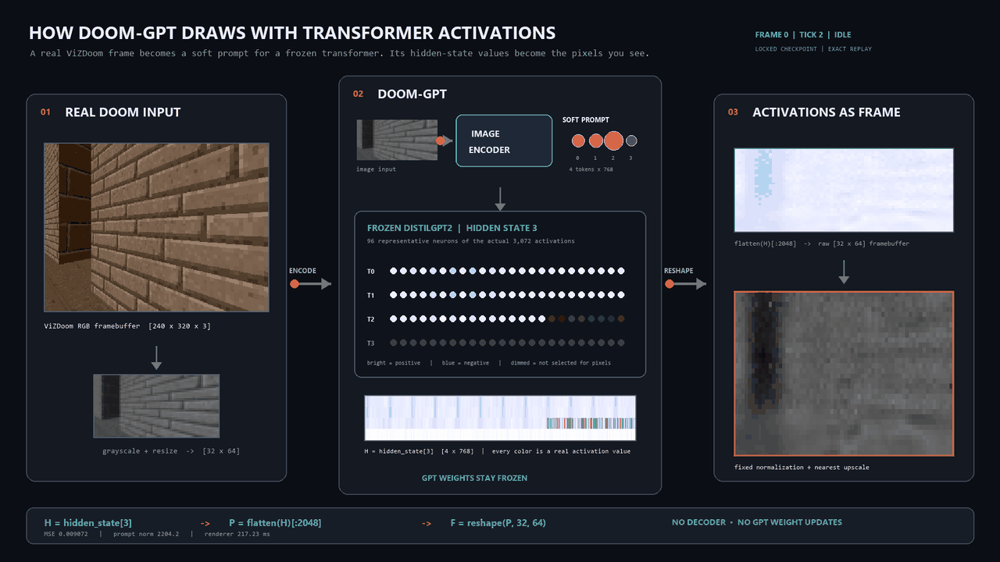

# DOOM-GPT: DOOM Rendered in GPT Internal Activations



## Can it run Doom? LLM internal activations


This repository is a real playable DOOM game rendered entirely from the internal activations of a frozen LLM.

The basic idea is:
1) provide specific input
2) The input will activate specific neurons in the LLM
3) The actual values of those neurons form a frame in the game
4) Stream inputs to the LLM to render the game in real time
5) Ignore the actual output, who cares about the text? we only care about the internals.

This is a DS \ AI approach, I did not implement any game logic or graphics geometry due to lack of knowledge and uncertainty about hypothesis weather or not internal activations are locally correlated or can act as an environment.

```text
real ViZDoom frame
        |
        v
64x32 grayscale input
        |
        v
image encoder -> soft prompt [4,768]
        |
        v
frozen DistilGPT2 -> hidden_state[3] [4,768]
        |
        v
flatten -> first 2,048 activations -> reshape [32,64]
        |
        v
fixed normalization + nearest-neighbor upscale
        |
        v
activation-only DOOM display
```

The important part is that the final image is constructed from the GPT hidden
state itself. It is not an original frame placed over a heatmap, and there is
no image decoder after the transformer.

## The exact activation mapping

The successful experiment uses one fixed, documented mapping:

```text
H = hidden_state[3]              shape [4,768]
P = flatten(H)[:2048]            2,048 raw activation values
F = reshape(P, 32, 64)           activation framebuffer
```

Tokens 0 and 1 contribute 768 pixels each. Token 2 contributes 512 pixels.
Token 3 is unused by the current slice. A single global activation mean and
standard deviation map `F` into the loss/display space; per-frame min/max
normalization is never used for the live activation-only display.

The DistilGPT2 parameters remain frozen. During early inversion experiments
only a soft prompt was optimized; the later real-time version trains only the
image-to-soft-prompt encoder.

## Milestones

| Milestone                         | What changed                                                                                                                       | Result                                                                                     |
|-----------------------------------|------------------------------------------------------------------------------------------------------------------------------------|--------------------------------------------------------------------------------------------|
| **1. Activation viewer**          | Loaded frozen DistilGPT2, captured hidden states, and reshaped a deterministic activation slice.                                   | Confirmed hidden shape `[1,4,768]` and produced the first activation framebuffer.          |
| **2. Synthetic inversion**        | Optimized only a four-token soft prompt so the activation framebuffer matched a simple image.                                      | Loss fell from `1.965` to `0.663`; transformer hash stayed unchanged.                      |
| **3. Real DOOM frame**            | Replaced the synthetic target with one real ViZDoom frame.                                                                         | Three seeds visibly recovered the wall/floor split and weapon; best final MSE was `0.131`. |
| **4. ViZDoom dataset**            | Collected split-safe gameplay data from `deathmatch.cfg`.                                                                          | Generated and validated 25,000 varied frames across 84 episodes.                           |
| **5. Amortized renderer**         | Trained a small CNN encoder to produce a soft prompt for each frame.                                                               | Test MSE `0.00603`; renderer-only batch-1 latency about `2.53 ms`; GPT stayed frozen.      |
| **6. Live playable pipeline**     | Connected ViZDoom, the encoder, frozen GPT, and activation framebuffer at game-tic speed.                                          | Recorded activation-only play at roughly 35 FPS, with temporal and integrity metrics.      |
| **7. Provenance dashboard**       | Added synchronized hidden-state, raw-slice, source-token, metrics, and pixel-inspection panels.                                    | Verified replay frames reproduced their stored activation displays byte-for-byte.          |
| **8. Presentation demo**          | Added a separate 16:9 visual story showing input, real neurons/activations, and the resulting frame.                               | Produces the GIF above plus 1920x1080 screenshots from the recorded session.               |
| **9. No VizDoom, No fake frames** | Let the encoder learn a state of the game instead of the frame, then use it to drop VizDoom completely and form the real DOOM-GPT! | In-Progress                                                                                |

Detailed experiment decisions, measurements, and limitations are recorded in
[`docs/EXECPLAN.md`](docs/EXECPLAN.md).

## Run the presentation

From PowerShell in the repository root:

```powershell
$py = "C:\Users\eladc\.cache\codex-runtimes\codex-primary-runtime\dependencies\python\python.exe"
$env:PYTHONPATH = (Resolve-Path ".deps").Path + ";" + (Resolve-Path "src").Path
$env:HF_HOME = (Resolve-Path ".").Path + "\.hf_cache"
$env:MPLCONFIGDIR = (Resolve-Path ".").Path + "\.mplconfig"

& $py -m activation_doom.presentation
```

The default presentation replays:

```text
experiments/m6_live/20260820-interactive-user
```

Presentation controls:

- `Space`: play or pause
- `Left` / `Right`: step backward or forward
- `+` / `-`: change playback speed
- `J`: jump to a recorded sequence number
- `S`: save a 1920x1080 screenshot
- `G`: export a five-second GIF
- `Esc`: quit

Presentation artifacts are written under
`experiments/m8_presentation/<timestamp>/`.

## Run live activation-only DOOM

```powershell
& $py -m activation_doom.live play --record
```

Add the full provenance dashboard:

```powershell
& $py -m activation_doom.live play --dashboard --record
```

Live controls:

- `W` / `S`: forward or backward
- `A` / `D`: strafe left or right
- `Left` / `Right`: turn
- `Space`: attack
- `Shift`: speed
- `C`: toggle original/activation comparison
- `R`: toggle recording
- `Tab`: toggle the provenance dashboard
- `F12`: save a dashboard screenshot
- `Esc`: quit

## Replay the technical dashboard

```powershell
& $py -m activation_doom.dashboard replay experiments/m6_live/20260820-interactive-user
```

The dashboard exposes the evidence behind the visual claim: the selected
`[4,768]` hidden state, the exact raw `[32,64]` slice, pixel-to-token
provenance, prompt norms, reconstruction error, temporal error, and renderer
latency. Clicking a pixel reveals its flat activation index, source token,
hidden dimension, raw value, loss-space value, and final display value.

## Setup

Install the pinned dependencies into the local `.deps` directory:

```powershell
& $py -m pip install --disable-pip-version-check --target .deps -r requirements.txt
```

CUDA is used when available; CPU fallback is supported where practical. The
successful experiments used an RTX 5090 and `distilbert/distilgpt2`.

Run the tests:

```powershell
& $py -m pytest -q
```

Current verification: **26 tests passing**.

## Reproduce earlier milestones

```powershell
# Milestone 1: activation viewer
& $py -m activation_doom.experiment viewer

# Milestone 2: synthetic activation inversion
& $py -m activation_doom.experiment invert --steps 200

# Milestone 3: one real DOOM frame
& $py -m activation_doom.experiment doom --steps 1500 --seeds 1234 1235 1236

# Milestone 4: collect and validate a dataset
& $py -m activation_doom.data.collect --output data/vizdoom_v1 --frames 25000 --seed 42 --overwrite
& $py -m activation_doom.data.validate data/vizdoom_v1

# Milestone 5: train and evaluate the amortized renderer
& $py -m activation_doom.renderer all --dataset data/vizdoom_v1

# Milestone 6: temporal, integrity, and stress evaluation
& $py -m activation_doom.live evaluate
```

Experiment outputs are written below `experiments/`; datasets are written
below `data/`.

## Scientific guardrails

- DistilGPT2 stays frozen.
- The framebuffer is selected directly from an internal hidden-state tensor.
- There is no learned decoder after GPT.
- The target frame is never overlaid on the activation display.
- Fixed calibration is used for the live image so per-frame normalization
  cannot manufacture temporal structure.
- Checkpoint and transformer hashes are verified before live playback.

## Future work

I am currently exploring a few direction to enhance the project and some research directions as well.
Game enhancements:
1) Use the rest of the hidden state to render higher resolution.
2) Use the rest of the hidden state to render color frames.
3) Multi Frane Generation: use other layers to generate the frame multiple time for upscaling

Future research directions:
1) Can latent space hold information about a state?
2) Definition of regions in the input space that are locally correlated in the latent space.
